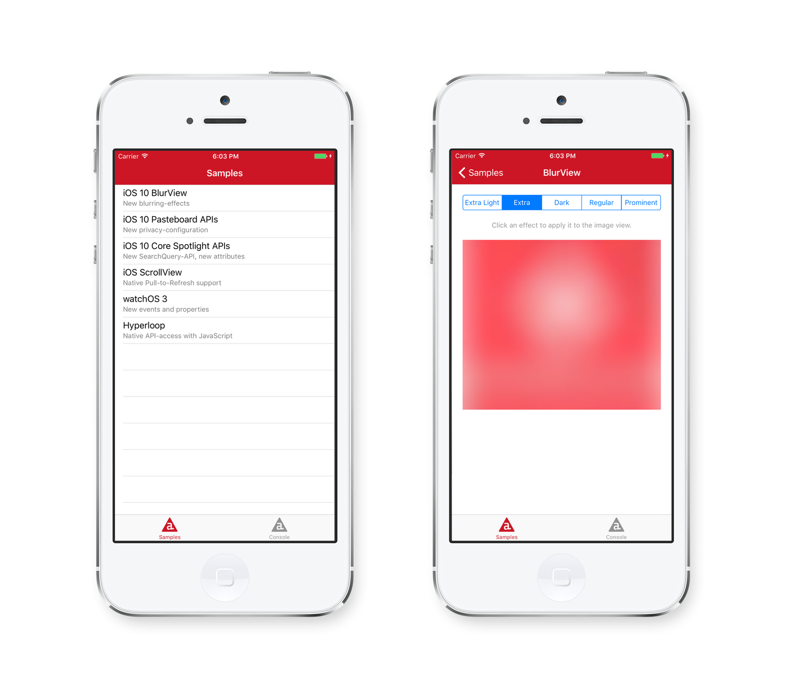

# Titanium 5.5.0 Sample App

> **NOTE:** This Sample App requires Titanium >= 5.5.0 and Alloy >= 1.9.0 (part of AppC CLI >=5.5.0). It demonstrates support iOS 10 and Xcode 8.

For more information on Titanium 5.5.0 and Appcelerator Studio 4.7.1 see the [official announcement](https://www.appcelerator.com/blog/2016/09/ga-release-for-titanium-sdk-5-5-0-appcelerator-cli-5-5-0-appcelerator-studio-4-7-1/), which also links the release notes, new feature, improvements and bugfixes.

## Running the Sample

### Via Appcelerator Studio

1. Import it via *Dashboard* if available.
2. Or import it via *File > Import... > Git > Git Repository as New Project* with *URI*:

		https://github.com/appcelerator-developer-relations/appc-sample-ti550

3. Select a Simulator or Device to build to via *Run > Run As*.

### Via CLI

1. Clone the repository:

		git clone https://github.com/appcelerator-developer-relations/appc-sample-ti550

2. To run it with `appc run` first import it to the platform:

		appc new --import --no-services

3. Build to Simulator or Device:

		[appc run | ti build] -p ios [-T device]
